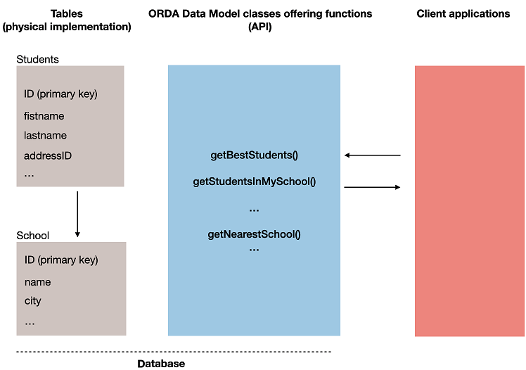
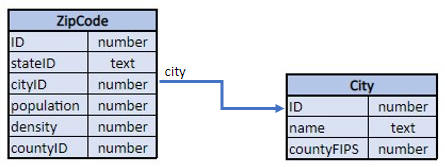

ORDA allows you to create high-level class functions above the data model. This allows you to write business-oriented code and "publish" it just like an API. Datastore, dataclasses, entity selections, and entities are all available as class objects that can contain functions.

For example, you could create a `getNextWithHigherSalary()` function in the `EmployeeEntity` class to return employees with a salary higher than the selected one. It would be as simple as calling:

```4d
$nextHigh:=ds.Employee(1).getNextWithHigherSalary()
```

Developers can not only use these functions in local datastores, but also in remote architectures:

```4d
 //$cityManager is the reference of a remote datastore
Form.comp.city:=$cityManager.City.getCityName(Form.comp.zipcode)
```

Thanks to this feature, the entire business logic of your 4D application can be stored as a independent layer so that it can be easily maintained and reused with a high level of security:

- You can "hide" the overall complexity of the underlying physical structure and only expose understandable and ready-to-use functions. 

- If the physical structure evolves, you can simply adapt function code and client applications will continue to call them transparently. 

- By default, all of your data model class functions (including [computed attribute functions](#computed-attributes)) are **not exposed** to remote applications and cannot be called from REST requests. You must explicitly declare each public function with the [`exposed`](#exposed-vs-non-exposed-functions) keyword.




## Architecture

ORDA provides **generic classes** exposed through a **`4D`** class store, as well as **user classes** (extending generic classes) exposed in the **`cs`** class store:


All ORDA data model classes are exposed as properties of the **`cs`** class store. The following ORDA classes are available:

|Class|Example name|Instantiated by|
|---|---|---|
|cs.DataStore|cs.DataStore|[`ds`](API/DataStoreClass.md#ds) command|
|cs.*DataClassName*|cs.Employee|[`dataStore.DataClassName`](API/DataStoreClass.md#dataclassname), `dataStore["DataClassName"]`|
|cs.*DataClassName*Entity|cs.EmployeeEntity|[`dataClass.get()`](API/DataClassClass.md#get), [`dataClass.new()`](API/DataClassClass.md#new), [`entitySelection.first()`](API/EntitySelectionClass.md#first), [`entitySelection.last()`](API/EntitySelectionClass.md#last), [`entity.previous()`](API/EntityClass.md#previous), [`entity.next()`](API/EntityClass.md#next), [`entity.first()`](API/EntityClass.md#first), [`entity.last()`](API/EntityClass.md#last), [`entity.clone()`](API/EntityClass.md#clone)|
|cs.*DataClassName*Selection|cs.EmployeeSelection|[`dataClass.query()`](API/DataClassClass.md#query), [`entitySelection.query()`](API/EntitySelectionClass.md#query), [`dataClass.all()`](API/DataClassClass.md#all), [`dataClass.fromCollection()`](API/DataClassClass.md#fromcollection), [`dataClass.newSelection()`](API/DataClassClass.md#newselection), [`entitySelection.drop()`](API/EntitySelectionClass.md#drop), [`entity.getSelection()`](API/EntityClass.md#getselection), [`entitySelection.and()`](API/EntitySelectionClass.md#and), [`entitySelection.minus()`](API/EntitySelectionClass.md#minus), [`entitySelection.or()`](API/EntitySelectionClass.md#or), [`entitySelection.orderBy()`](API/EntitySelectionClass.md#or), [`entitySelection.orderByFormula()`](API/EntitySelectionClass.md#orderbyformula), [`entitySelection.slice()`](API/EntitySelectionClass.md#slice), `Create entity selection`|

Also, object instances from ORDA data model user classes benefit from their parent's properties and functions:

- a Datastore class object can call functions from the [ORDA Datastore generic class](API/DataStoreClass.md).
- a Dataclass class object can call functions from the [ORDA Dataclass generic class](API/DataClassClass.md).
- an Entity selection class object can call functions from the [ORDA Entity selection generic class](API/EntitySelectionClass.md).
- an Entity class object can call functions from the [ORDA Entity generic class](API/EntityClass.md).


## Class Description

### DataStore Class


A database exposes its own DataStore class in the `cs` class store. 

- **Extends**: 4D.DataStoreImplementation 
- **Class name**: cs.DataStore

You can create functions in the DataStore class that will be available through the `ds` object. 

#### Example

```4d  
// cs.DataStore class

Class extends DataStoreImplementation

Function getDesc
  $0:="Database exposing employees and their companies"
```


This function can then be called:

```4d
$desc:=ds.getDesc() //"Database exposing..."
```


### DataClass Class

Each table exposed with ORDA offers a DataClass class in the `cs` class store.

- **Extends**: 4D.DataClass 
- **Class name**: cs.*DataClassName* (where *DataClassName* is the table name)
- **Example name**: cs.Employee


#### Example

```4d
// cs.Company class


Class extends DataClass

// Returns companies whose revenue is over the average
// Returns an entity selection related to the Company DataClass

Function GetBestOnes()
	$sel:=This.query("revenues >= :1";This.all().average("revenues"));
	$0:=$sel
```

Then you can get an entity selection of the "best" companies by executing: 

```4d
	var $best : cs.CompanySelection
	$best:=ds.Company.GetBestOnes()
```

:::note

[Computed attributes](#computed-attributes) are defined in the [Entity Class](#entity-class). 

:::

#### Example with a remote datastore

The following *City* catalog is exposed in a remote datastore (partial view):



Zipcodes are used as primary keys of the *ZipCode* table. The many-to-one relation attribute between cityID and ID is named *city*.

The `City Class` provides an API:

```4d  
// cs.City class

Class extends DataClass

Function getCityName($zipcode : Integer) : Text
	var $zip : cs.ZipCodeEntity

	$zip:=ds.ZipCode.get($zipcode)
	$0:="" 

	If ($zip#Null)
		$0:=$zip.city.name
	End if
```

The client application opens a session on the remote datastore:

```4d
$cityManager:=Open datastore(New object("hostname";"127.0.0.1:8111");"CityManager")
```

Then a client application can use the API to get the city matching a zip code (for example) from a form:

```4d
Form.comp.city:=$cityManager.City.getCityName(Form.comp.zipcode)

```


### EntitySelection Class

Each table exposed with ORDA offers an EntitySelection class in the `cs` class store.

- **Extends**: 4D.EntitySelection 
- **Class name**: *DataClassName*Selection (where *DataClassName* is the table name)
- **Example name**: cs.EmployeeSelection


#### Example

```4d
// cs.EmployeeSelection class


Class extends EntitySelection

//Extract the employees with a salary greater than the average from this entity selection 

Function withSalaryGreaterThanAverage() : Object
	$0:=This.query("salary > :1";This.average("salary")).orderBy("salary")

```

Then you can get employees with a salary greater than the average in any entity selection by executing: 

```4d
$moreThanAvg:=ds.Company.all().employees.withSalaryGreaterThanAverage()
```

### Entity Class

Each table exposed with ORDA offers an Entity class in the `cs` class store.

- **Extends**: 4D.Entity 
- **Class name**: *DataClassName*Entity (where *DataClassName* is the table name)
- **Example name**: cs.CityEntity

Entity classes allow you to define **computed attributes** using specific keywords:

- `Function get` *attributeName*
- `Function set` *attributeName*
- `Function query` *attributeName*
- `Function orderBy` *attributeName*

For more information, please refer to the [Computed attributes](#computed-attributes) section. 

#### Example


```4d
// cs.CityEntity class

Class extends Entity

Function getPopulation() : Integer
    $0:=This.zips.sum("population")


Function isBigCity() : Boolean
// The getPopulation() function is usable inside the class
$0:=This.getPopulation()>50000
```

Then you can call this code: 

```4d
var $cityManager; $city : Object
var $message : Text

$cityManager:=Open datastore(New object("hostname";"127.0.0.1:8111");"CityManager")
$city:=$cityManager.City.getCity("Caguas")

If ($city.isBigCity())
	$message:=$city.name + " is a big city"
End if
```

### Specific rules

When creating or editing data model classes, you must pay attention to the following rules:

- Since they are used to define automatic DataClass class names in the **cs** [class store](Concepts/classes.md#class-stores), tables must be named in order to avoid any conflict in the **cs** namespace. In particular:
	- Do not give the same name to a table and to a user class name. If such a case occurs, the constructor of the user class becomes unusable. 
	- Do not use a reserved name for a table (e.g., "DataClass").

- When defining a class, make sure the [`Class extends`] statement exactly matches the parent class name (remember that they're case sensitive). For example, `Class extends EntitySelection` for an entity selection class.

- You cannot instantiate a data model class object with the `new()` keyword (an error is returned). You must use a regular method as listed in the [`Instantiated by` column of the ORDA class table](#architecture).

- You cannot override a native ORDA class function from the **`4D`** [class store](Concepts/classes.md#class-stores) with a data model user class function.


## Computed attributes


### Overview

A computed attribute is a dataclass attribute with a data type that masks a calculation.

At the very minimum, a computed attribute requires a `get` function that describes how its value will be calculated. When a *getter* function is supplied for an attribute, ORDA does not create the underlying storage space in the datastore but instead substitutes the function's code each time the attribute is accessed. If the attribute is not accessed, the code never executes.

A computed attribute can also implement a `set` function, which executes whenever a value is assigned to the attribute. The *setter* function describes what to do with the assigned value, usually redirecting it to one or more storage attributes or in some cases other entities.

Just like storage attributes, computed attributes may be included in **queries**. By default, when a computed attribute is used in a ORDA query, the attribute is calculated once per entity examined. In some cases this is sufficient. However for better performance, especially in client/server, computed attributes can implement a `query` function that relies on actual dataclass attributes and benefits from their indexes.

Similarly, computed attributes can be included in **sorts**. When a computed attribute is used in a ORDA sort, the attribute is calculated once per entity examined. Just like in queries, computed attributes can implement an `orderBy` function that substitutes other attributes during the sort, thus increasing performance. 


### How to define computed attributes

You create a computed attribute by defining a `get` accessor in the [**entity class**](#entity-class) of the dataclass. The computed attribute will be automatically available in the dataclass attributes and in the entity attributes.

Other computed attribute functions (`set`, `query`, and `orderBy`) can also be defined in the entity class. They are optional.

Within computed attribute functions, `This` designates the entity. Computed attributes can be used and handled as any dataclass attribute, i.e. they will be processed by [entity class](API/EntityClass.md) or [entity selection class](API/EntitySelectionClass.md) functions. 

> ORDA computed attributes are not [**exposed**](#exposed-vs-non-exposed-functions) by default. You expose a computed attribute by adding the `exposed` keyword to the **get function** definition.


### `Function get <attributeName>`

#### Syntax

```4d
{exposed} Function get <attributeName>({$event : Object}) -> $result : type
// code
```
The *getter* function is mandatory to declare the *attributeName* computed attribute. Whenever the *attributeName* is accessed, the `Function get` code is evaluated and the *$result* value is returned. 

> A computed attribute can use the value of other computed attribute(s). Recursive calls generate errors. 

The *getter* function defines the data type of the computed attribute thanks to the *$result* parameter. The following resulting types are allowed:

- Scalar (text, boolean, date, time, number)
- Object
- Image
- BLOB
- Entity (i.e. cs.EmployeeEntity)
- Entity selection (i.e. cs.EmployeeSelection)

The *$event* parameter contains the following properties:

|Property|Type|Description|
|---|---|---|
|attributeName|Text|Computed attribute name|
|dataClassName|Text|Dataclass name|
|kind|Text|"get"|
|result|Variant|Optional. Add this property with Null value if you want a scalar attribute to return Null|


#### Examples

- *fullName* computed attribute:

```4d
Function get fullName($event : Object)-> $fullName : Text

  Case of 	
	: (This.firstName=Null) & (This.lastName=Null)
		$event.result:=Null //use result to return Null
	: (This.firstName=Null)
		$fullName:=This.lastName
	: (This.lastName=Null)
		$fullName:=This.firstName
	Else 
		$fullName:=This.firstName+" "+This.lastName
	End case 
```

- A computed attribute can be based upon an entity related attribute:

```4d
Function get bigBoss($event : Object)-> $result: cs.EmployeeEntity
	$result:=This.manager.manager
    
```

- A computed attribute can be based upon an entity selection related attribute:

```4d
Function get coWorkers($event : Object)-> $result: cs.EmployeeSelection
    If (This.manager.manager=Null)
        $result:=ds.Employee.newSelection()
    Else 
        $result:=This.manager.directReports.minus(this)
    End if
```
    
### `Function set <attributeName>`

#### Syntax

```4d
Function set <attributeName>($value : type {; $event : Object})
// code
```

The *setter* function executes whenever a value is assigned to the attribute. This function usually processes the input value(s) and the result is dispatched between one or more other attributes.

The *$value* parameter receives the value assigned to the attribute. 

The *$event* parameter contains the following properties:

|Property|Type|Description|
|---|---|---|
|attributeName|Text|Computed attribute name|
|dataClassName|Text|Dataclass name|
|kind|Text|"set"|
|value|Variant|Value to be handled by the computed attribute|

#### Example

```4d
Function set fullName($value : Text; $event : Object)
	var $p : Integer
    $p:=Position(" "; $value) 		
	This.firstname:=Substring($value; 1; $p-1)  // "" if $p<0
	This.lastname:=Substring($value; $p+1)
```


### `Function query <attributeName>`

#### Syntax

```4d
Function query <attributeName>($event : Object)
Function query <attributeName>($event : Object) -> $result : Text
Function query <attributeName>($event : Object) -> $result : Object
// code
```

This function supports three syntaxes:

- With the first syntax, you handle the whole query through the `$event.result` object property.
- With the second and third syntaxes, the function returns a value in *$result*:
	- If *$result* is a Text, it must be a valid query string
	- If *$result* is an Object, it must contain two properties:
	
	|Property|Type|Description|
	|---|---|---|
	|$result.query|Text|Valid query string with placeholders (:1, :2, etc.)|
	|$result.parameters|Collection|values for placeholders|

The `query` function executes whenever a query using the computed attribute is launched. It is useful to customize and optimize queries by relying on indexed attributes. When the `query` function is not implemented for a computed attribute, the search is always sequential (based upon the evaluation of all values using the `get <AttributeName>` function).

> The following features are not supported:
> - calling a `query` function on computed attributes of type Entity or Entity selection, 

> - using the `order by` keyword in the resulting query string.

The *$event* parameter contains the following properties:

|Property|Type|Description|
|---|---|---|
|attributeName|Text|Computed attribute name|
|dataClassName|Text|Dataclass name|
|kind|Text|"query"|
|value|Variant|Value to be handled by the computed attribute|
|operator|Text|Query operator (see also the [`query` class function](API/DataClassClass.md#query)). Possible values:<li>== (equal to, @ is wildcard)</li><li>=== (equal to, @ is not wildcard)</li><li>!= (not equal to, @ is wildcard)</li><li>!== (not equal to, @ is not wildcard)</li><li>< (less than)</li><li><= (less than or equal to)</li><li>> (greater than)</li><li>>= (greater than or equal to)</li><li>IN (included in)</li><li>% (contains keyword)</li>|
|result|Variant|Value to be handled by the computed attribute. Pass `Null` in this property if you want to execute a default query (always sequential for computed attributes).|

> If the function returns a value in *$result* and another value is assigned to the `$event.result` property, the priority is given to `$event.result`. 

#### Examples

- Query on the *fullName* computed attribute. 

```4d
Function query fullName($event : Object)->$result : Object

	var $fullname; $firstname; $lastname; $query : Text
	var $operator : Text
	var $p : Integer
	var $parameters : Collection

	$operator:=$event.operator
	$fullname:=$event.value

	$p:=Position(" "; $fullname) 
	If ($p>0)
		$firstname:=Substring($fullname; 1; $p-1)+"@"
		$lastname:=Substring($fullname; $p+1)+"@"
		$parameters:=New collection($firstname; $lastname) // two items collection
	Else 
		$fullname:=$fullname+"@"
		$parameters:=New collection($fullname) // single item collection
	End if 

	Case of 
	: ($operator="==") | ($operator="===")
		If ($p>0)
			$query:="(firstName = :1 and lastName = :2) or (firstName = :2 and lastName = :1)"
		Else 
			$query:="firstName = :1 or lastName = :1"
		End if 
	: ($operator="!=")
		If ($p>0)
			$query:="firstName != :1 and lastName != :2 and firstName != :2 and lastName != :1"
		Else 
			$query:="firstName != :1 and lastName != :1"
		End if 
	End case 

	$result:=New object("query"; $query; "parameters"; $parameters)
```

> Keep in mind that using placeholders in queries based upon user text input is recommended for security reasons (see [`query()` description](API/DataClassClass.md#query)).

Calling code, for example:

```4d
$emps:=ds.Employee.query("fullName = :1"; "Flora Pionsin")
```

- This function handles queries on the *age* computed attribute and returns an object with parameters:

```4d
Function query age($event : Object)->$result : Object
	
	var $operator : Text
	var $age : Integer
	var $_ages : Collection
	
	$operator:=$event.operator
			
	$age:=Num($event.value)  // integer
	$d1:=Add to date(Current date; -$age-1; 0; 0)
	$d2:=Add to date($d1; 1; 0; 0)
	$parameters:=New collection($d1; $d2)
	
	Case of 
			
		: ($operator="==")
			$query:="birthday > :1 and birthday <= :2"  // after d1 and before or egal d2
			
		: ($operator="===") 

			$query:="birthday = :2"  // d2 = second calculated date (= birthday date)

		: ($operator=">=")
			$query:="birthday <= :2"
			
			//... other operators			
			
			
	End case 
	
	
	If (Undefined($event.result))
		$result:=New object
		$result.query:=$query
		$result.parameters:=$parameters
	End if

```  

Calling code, for example:

```4d
// people aged between 20 and 21 years (-1 day)
$twenty:=people.query("age = 20")  // calls the "==" case

// people aged 20 years today
$twentyToday:=people.query("age === 20") // equivalent to people.query("age is 20") 

```


### `Function orderBy <attributeName>`

#### Syntax

```4d
Function orderBy <attributeName>($event : Object)
Function orderBy <attributeName>($event : Object)-> $result : Text

// code
```

The `orderBy` function executes whenever the computed attribute needs to be ordered. It allows sorting the computed attribute. For example, you can sort *fullName* on first names then last names, or conversely.
When the `orderBy` function is not implemented for a computed attribute, the sort is always sequential (based upon the evaluation of all values using the `get <AttributeName>` function).

> Calling an `orderBy` function on computed attributes of type Entity class or Entity selection class **is not supported**. 

The *$event* parameter contains the following properties:

|Property|Type|Description|
|---|---|---|
|attributeName|Text|Computed attribute name|
|dataClassName|Text|Dataclass name|
|kind|Text|"orderBy"|
|value|Variant|Value to be handled by the computed attribute|
|operator|Text|"desc" or "asc" (default)|
|descending|Boolean|`true` for descending order, `false` for ascending order|
|result|Variant|Value to be handled by the computed attribute. Pass `Null` if you want to let 4D execute the default sort.|

> You can use either the `operator` or the `descending` property. It is essentially a matter of programming style (see examples).   

You can return the `orderBy` string either in the `$event.result` object property or in the *$result* function result. If the function returns a value in *$result* and another value is assigned to the `$event.result` property, the priority is given to `$event.result`. 


#### Example

You can write conditional code:

```4d
Function orderBy fullName($event : Object)-> $result : Text
    If ($event.descending=True)
        $result:="firstName desc, lastName desc" 
    Else 
        $result:="firstName, lastName" 
    End if
```

You can also write compact code:

```4d
Function orderBy fullName($event : Object)-> $result : Text
	$result:="firstName "+$event.operator+", "lastName "+$event.operator

```

Conditional code is necessary in some cases:

```4d
Function orderBy age($event : Object)-> $result : Text
    If ($event.descending=True)
        $result:="birthday asc" 
    Else 
        $result:="birthday desc" 
    End if

```


## Exposed vs non-exposed functions

For security reasons, all of your data model class functions are **not exposed** (i.e., private) by default to remote requests. 

Remote requests include:

- Requests sent by remote applications connected through `Open datastore` 
- REST requests

A function that is not exposed is not available on remote applications and cannot be called on any object instance from a REST request. If a remote application tries to access a non-exposed function, the "-10729 - Unknown member method" error is returned. 

To allow a data model class function to be called by a remote request, you must explicitly declare it using the `exposed` keyword. The formal syntax is:

```4d  
// declare an exposed function
exposed Function <functionName>   
```

:::note

The `exposed` keyword can only be used with Data model class functions. If used with a [regular user class](Concepts/classes.md) function, it is ignored.

:::

### Example 

You want an exposed function to use a private function in a dataclass class:

```4d
Class extends DataClass

//Public function
exposed Function registerNewStudent($student : Object) -> $status : Object

var $entity : cs.StudentsEntity

$entity:=ds.Students.new()
$entity.fromObject($student)
$entity.school:=This.query("name=:1"; $student.schoolName).first()
$entity.serialNumber:=This.computeSerialNumber()
$status:=$entity.save()

//Not exposed (private) function
Function computeIDNumber()-> $id : Integer
//compute a new ID number
$id:=...

```

When the code is called:

```4d
var $remoteDS; $student; $status : Object
var $id : Integer

$remoteDS:=Open datastore(New object("hostname"; "127.0.0.1:8044"); "students")
$student:=New object("firstname"; "Mary"; "lastname"; "Smith"; "schoolName"; "Math school")

$status:=$remoteDS.Schools.registerNewStudent($student) // OK
$id:=$remoteDS.Schools.computeIDNumber() // Error "Unknown member method" 
```

